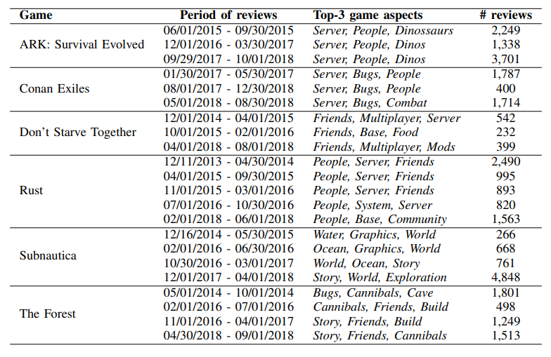

# Dataset for GA-Eval: A Neural Network based approach to evaluate Video Games Acceptance
The purpose of this Git repository is to publish the dataset aswell as the training and validation set used in the short paper *GA-Eval: A Neural Network based approach to evaluate Video Games Acceptance*

## Notes on the complete Dataset
- This repository contains both datasets used (Steam and Dragon Age Reviews) compressed in the file
- The datasets have been preprocessed and may not be human readable
- The dataset has been categorized by game and time period and the reviews have been filtered as to only contain the top 3 most frequent aspects
- The table below shows the number of reviews and aspects by time period:

## Training data

- The training and validation sets used in the experiments have also been included
  - The Labels files match each review txt file when those are ordered alphanumerically
  - The labels are the following:
    - 1 -> Positive
    - 2 -> Neutral
    - 3 -> Negative
